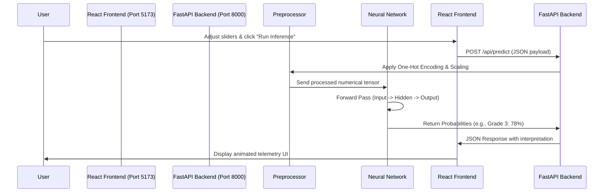

# QuakeSense: Complete Project Architecture & Learning Guide

Welcome to the comprehensive breakdown of the QuakeSense project. This document explains the complete lifecycle of our earthquake building damage prediction system—from the raw dataset inputs, through the machine learning pipeline, all the way to the frontend React interface.

---

## 1. The Goal and The Dataset

### The Objective
Following the devastating 2015 Gorkha earthquake in Nepal, massive data was collected on building survival and collapse. Our system's goal is to predict the **Damage Grade** of a building based on its structural and geographic characteristics.

The damage grades are:
* **Grade 1 (Low):** Minor damage, safe for use.
* **Grade 2 (Medium):** Moderate damage, requires repair.
* **Grade 3 (High):** Complete destruction or severe structural failure.

### The Input Data
The system trains on **260,601** building records, each containing **38 features** (variables).

These features fall into three main categories:
1. **Geographic (Telemetry):** `geo_level_1_id`, `geo_level_2_id`, `geo_level_3_id`. These represent geographic zones (like state, county, municipality). *Geo Level 1 is highly predictive because proximity to the earthquake epicenter dramatically impacts damage.*
2. **Numerical (Dimensions):** `age`, `area_percentage`, `height_percentage`, `count_floors_pre_eq`.
3. **Categorical / Binary (Materials & Structure):** Information like `foundation_type`, `roof_type`, and 11 binary flags for the superstructure material (e.g., `has_superstructure_mud_mortar_stone`, `has_superstructure_rc_engineered`).

> [!NOTE] Class Imbalance
> In the real world, and in this dataset, damage isn't evenly distributed. About **57%** of buildings suffered Grade 2 damage, **33.5%** suffered Grade 3, and only **9.6%** had Grade 1 damage. Our models use "class weights" during training to penalize errors on rare classes, ensuring it doesn't cheat by just guessing "Grade 2" every time.

---

## 2. Data Preprocessing (The Pipeline)

Machine learning models only understand numbers, so we cannot feed raw text like `foundation_type: 'r'` directly into a neural network. 

Before training, data passes through a **Preprocessor Pipeline**:
* **Standard Scaling (for Numerical Data):** We normalize continuous variables (like `age` or `area_percentage`) so they have a mean of 0 and a standard deviation of 1. This prevents features with naturally large numbers (like `age: 100`) from overpowering features with small numbers (like `floors: 2`).
* **One-Hot Encoding (for Categorical Data):** We convert categories into binary columns. For example, `foundation_type` (which has 5 options) becomes 5 separate columns of 0s and 1s.

This pipeline is saved as `preprocessor.pkl` and applied instantly whenever a new prediction is requested via the website.

---

## 3. The Machine Learning Models

We experimented with three distinct architectures. The performance metric used to evaluate them is **Micro-F1 score**, which perfectly balances precision and recall across all three classes.

### A. Multi-Layer Perceptron (Neural Network) 🏆 *Winner*
* **Micro-F1 Score:** ~0.686
* **How it works:** A neural network consisting of an input layer, hidden "Dense" layers (64 nodes, then 32 nodes), and an output layer of 3 nodes (representing the 3 damage grades). It learns complex, non-linear interactions between features (e.g., how age interacts specifically with mud-mortar in a specific geographic zone).
* **Why it’s better:** It achieved the highest accuracy. It is extremely fast at making predictions (inference time is ~45ms) and its file size is tiny (~424 KB), making it ideal for a real-time web API.
* **Limitations:** It acts as a "black box," making it hard to extract simple rules explaining *why* it made a specific prediction.

### B. Random Forest 🥈 *Runner Up*
* **Micro-F1 Score:** ~0.681
* **How it works:** An "ensemble" method that builds hundreds of decision trees. Each tree gets a random subset of data and votes on the final damage grade. The majority vote wins.
* **Why it's good:** It handles tabular data excellently, requires very little preprocessing, and can easily output "Feature Importance" (showing us that `geo_level_1_id` is the most important feature).
* **Why it lost:** It was slightly less accurate than the Neural Network. Furthermore, saving hundreds of deep decision trees resulted in a massive file size (**~660 MB**), which consumes a lot of server RAM.

### C. K-Nearest Neighbors (KNN) 🥉 *Archived*
* **Micro-F1 Score:** ~0.640
* **How it works:** For a new building, KNN looks at the *K* (e.g., 5) most mathematically "similar" buildings in the training data and copies their damage grade.
* **Why it's good:** The concept is exceptionally simple to understand.
* **Why it lost (The Curse of Dimensionality):** With 38 features and 260,000 buildings, calculating the exact distance between a new building and *every single training building* takes an enormous amount of time. Inference is incredibly slow, and accuracy was the lowest of the three.

---

## 4. The System Architecture

When you interact with the QuakeSense website, here is exactly what happens under the hood:

### The Backend (FastAPI + Python)
* Built in Python using **FastAPI**.
* Validates incoming data using **Pydantic** to ensure all 38 features are present and correctly typed.
* Loads the saved `mlp_model.pkl` into memory on startup so it doesn't have to read the disk for every request.

### The Frontend (React + Vite + Tailwind)
* Built using the **Apple × Palantir × Scientific Mission Control** design philosophy.
* Emphasizes technical telemetry, minimal visual noise, dark themes, and high information density.
* Uses **Framer Motion** to orchestrate the subtle, premium animations that communicate the "processing" states to the user.

---

## 5. Key Discoveries from the Data

During Exploratory Data Analysis (EDA), we uncovered several absolute truths about the data:
1. **Geography is Destiny:** A building's proximity to the epicenter (`geo_level_1_id`) was the strongest predictor of failure, overriding almost all structural upgrades.
2. **Mud and Stone Collapses:** Buildings constructed with mud mortar and stone superstructures suffered catastrophic Grade 3 failure at terrifying rates (~74%).
3. **Concrete Survives:** Reinforced Concrete (RC) engineered structures survived overwhelmingly well, taking mostly Grade 1 (cosmetic) damage.

*This concludes the technical walkthrough of the QuakeSense project.*
